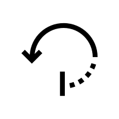

# SpacePython

This python algorithm can get you the best dates to do revisions - according to the Spaced Repitition techinique - given your exam date.

## Getting Started
You can run this code using an IDE or your terminal affter cloning the repository or simply downloading the two main files: generator.py and index.py.

For cloning the repository:

    git clone https://github.com/nydndr/spacePython.git

### Input
It couldn't be simpler:
- The date of your exam.

### Output
- How many days remaining til your exam
- The revision expected dates for maximum perfomance

## Contribution

No one has contributted to this repository yet, but I'm hoping someone will. If you have any idea on how to do this even more functional and useful, please say hi to me somewhere!

(The same is valid for critics and compliments, of course :)

## Authors
Nicoly Dandara. (By this time) 17 years old, third-year of high (and computing) school. I'm gonna be a designer and a developer someday - by this time, I'm none.

## License
This project works under the [MIT License](license.md).

## Acknowledgements
The Spaced Repetition technique is something preached over and over again by Ali Abdaal an excellent doctor, student and youtuber with great tips on how to do better in college and life.

The goal of this tool is to making my life easier when applying this principle and by mistake, maybe yours too.

### What I Learned In This Project
I wrote all this code after reading 6 chapters of Lean Python (Learn Just Enough Python For Building Useful Tools by Paul Gerrard) the first Python I've read, so basically I learned everything I know so far.

By this, I mean
- [X] Python syntax - and geez, it was hard
- [X] Input and ouput
- [X] Python modules
    - [X] Internals
    - [X] Externals
- [X] Python program structure
- [X] Datetime library